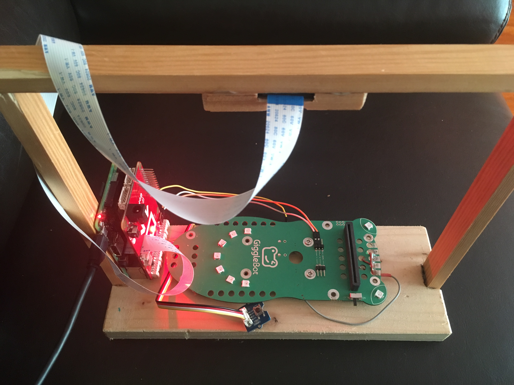
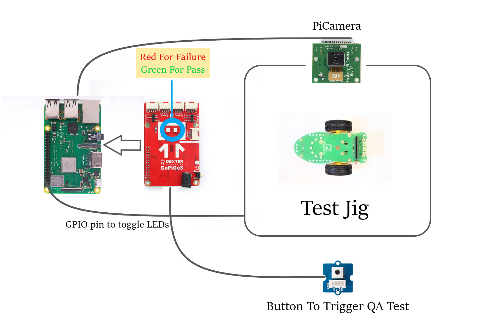
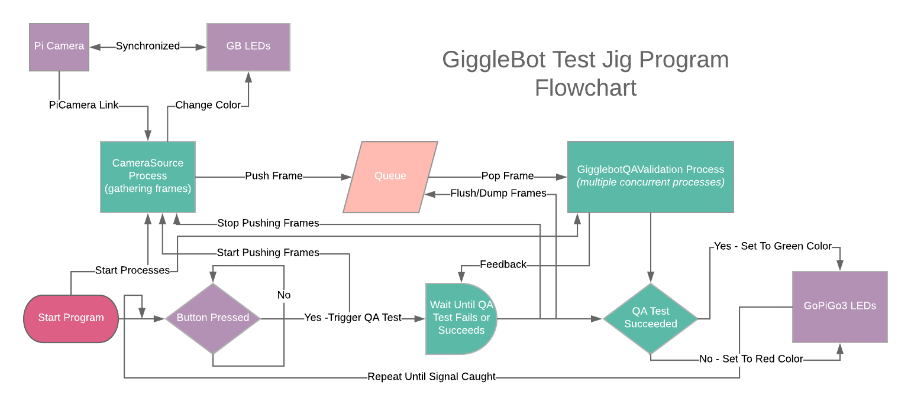
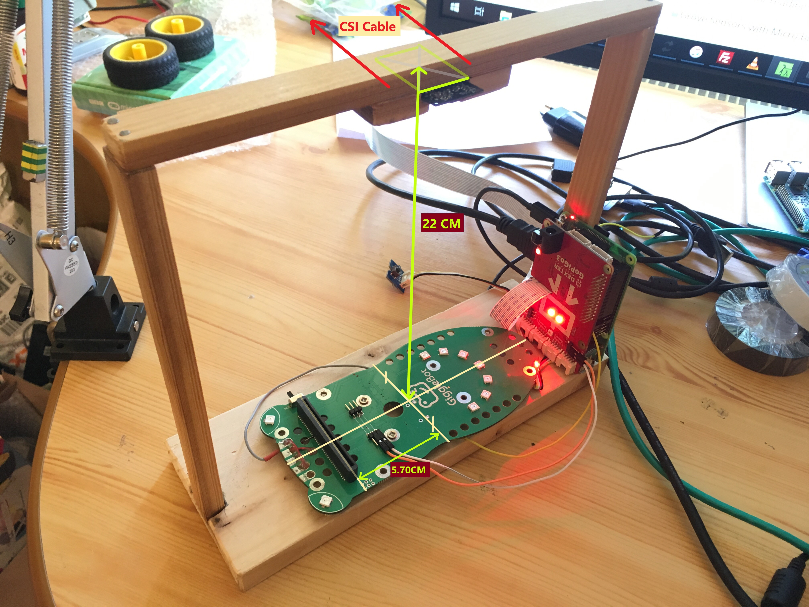

[](https://www.youtube.com/watch?v=0oBJICabVl4)

### This Repository Is a Mirror of a Folder On the Private Repo github.com/DexterInd/GiggleBotDev

## What Is This

This project is used for running QA tests on the GiggleBot board in China.
It's aimed at determining if the 9 LEDs on the board change their color or 
suddenly stop working during the testing phase. More onto how this project has been developed can be found out in this [article](https://www.robertlucian.com/2018/11/02/qa-led-gigglebot/).

To put it in a step-by-step process, this is what the testing phase looks like:
1. Place the GiggleBot in the test jig.
1. Press the button on the test jig to initate the QA test.
1. Keep staring at the status LED while it's flashing purple until the test finishes.
1. When the test finishes one of the 2 colors will show up: red for failure or green for having it passed.
1. Repeat.

## Required Setup

A couple of components are required in this puzzle:
1. GiggleBot to test — placed in the test jig.
1. GoPiGo3.
1. PiCamera (version v1.x) — v2.x is still not tested and it could work just fine. Along with a CSI cable.
1. Button — along with a Grove cable to connect it to the GoPiGo3.
1. Raspberry Pi (3 or 3B+).



## Configuring It

To run it with docker, you need to do 3 things:
1. Enable the PiCamera interface.
1. Enable the SPI interface.
1. Set the split size for the GPU high enough so the camera can work (e.g. 256MB).

To run it directly within the system-wide space, in addition to what's needed for docker, follow these instructions from this directory:
<details><summary>See command instructions</summary>
<p>

```bash
sudo apt-get update -qq && \
    sudo apt-get install libgtk2.0-dev libgtk-3-dev -y --no-install-recommends

sudo apt-get install python3 python3-dev python3-pip libraspberrypi-bin wiringpi -y --no-install-recommends \
    libjpeg-dev libtiff5-dev libjasper-dev libpng12-dev \
    libavcodec-dev libavformat-dev libswscale-dev libv4l-dev \
    libxvidcore-dev libx264-dev \
    libatlas-base-dev gfortran \
    openexr libilmbase12 libgstreamer1.0-dev libgstreamer-plugins-base1.0-dev libqtgui4 libqt4-test

sudo pip install virtualenv && virtualenv .venv -p python3 && source .venv/bin/activate
pip install pip --upgrade
pip install -r requirements.lock

git clone --depth=1 https://github.com/DexterInd/GoPiGo3
git clone --depth=1 https://github.com/DexterInd/RFR_Tools

cd GoPiGo3 && git reset --hard 5849047558aa1e573b49dc572adec44d9960084c && cd -
cd RFR_Tools && git reset --hard 2ec15465d8d69bffdea5314d5fd86812eaf68085 && cd -

pip install RFR_Tools/miscellaneous
pip install GoPiGo3/Software/Python
```

</p>
</details>

Once the configuration for either method is finished, reboot and go to the next section.

For Docker, if you want to build it locally on a x86 architecture, the 2 `cross-build-start` and `cross-build-end` have to be uncommented.

## Running It

There are 2 ways to run this: either by running the docker container or by running the script manually from the system-wide environment.

Upon launching the program, keep in mind that the WiFi LED turns <span style="color:green">green</span> when all systems are ready. When the program ends, the WiFi LED is turned off.

### Docker Style

```bash
docker container run -it --rm --name gbtest --privileged robertlucian/gbtest
```
To stop it, just stop the container or press CTRL-C if in interactive mode.
The container is on [hub.docker.com](https://hub.docker.com/r/robertlucian/gbtest/).

You can override the default config file with `-v $(pwd)/qa_config.json:/app/qa_config.json` option. 
If you run this without building the image, you risk getting an outdated version from the docker repository. Since this is a one-time project, it didn't make sense to put effort into setting up CI/CD systems.

If you intend to interface with the GoPiGo3 outside of the container, then binding the system's `/run/lock` to the container is mandatory. Do it with `-v /run/lock:/run/lock`.

If you want to set up a persistent storage for the container to keep the logs and the saved frames or generated GIFs you can mount a volume. The path must be set to `/app/data`. Go with something like `-v my-volume:/app/data`.

### Classic Mode

Running this is pretty straightforward.
```bash
sudo $(which python) main.py
```
Running the `main.py` script must be done in the same directory where all 3 other files are present (`gbtest.py`, `qa_config.json`, etc).

To kill the program, you either press CTRL-C when you're done with it, or shutdown the Raspberry Pi. In either case, the script will exit gracefully, thus anything that was operating at that moment won't get corrupted/mess up anything around.

## Validating the Test

To validate this test, one has to look at the GoPiGo3 eyes and wait until the flashing purple turns to either green or red. Green means the test has passed and red it means that it has failed.

After a test, the GiggleBot is replaced with another one and the button (connected to the GoPiGo3) is pressed again to initiate another test.


## Interpreting the GPG3's Eyes

* If the Raspberry Pi is booting up and the GPG3 eyes start flashing purple, then the PiCamera is not reachable. Possible causes: bad ribbon cable, malfunctioned camera, disabled camera, etc.

* If the Raspberry Pi is booting up and the GPG3 eyes start blinking red, then the `qa_config.json` file couldn't be read. This would mostly apply when you're building your own solution: aka not using the docker image.

* If the Raspberry Pi is booting up and the GPG3 eyes start blinking orange, then probably the scrip hasn't been launched with elevated permissions.

* If the Raspberry Pi has already booted up and pressing the button doesn't do anything, then it could be that the GPG3 is not reachable.

* If the Raspberry Pi has already booted up and pressing the button makes the GPG3 eyes to flash purple but the LEDs are not changing the color, then the camera could have lost the connection to the Pi. This happens pretty rare though.

## FAQ

**Question: The GoPiGo3's eyes keep flashing purple and the Gigglebot's LEDs don't switch colors.**

Answer: Most likely, the Raspberry Pi lost connection to the PiCamera or the PiCamera got disconnected or something. Or the GB's LEDs are not connected to the Raspberry Pi.

**Question: To what lighting conditions should the camera get exposed to?**

Answer: It should be fine with lamp-like conditions around, but to be absolutely sure it's all fine, a box should be placed on top of the test jig to cover for any unforseen exceptions. The exposure time of the camera is set very low, so that means something that is very bright (like the GB's LEDs) will appear on the video output.

**Question: Can I see some sample outputs of the video camera?**

Answer: You can set in the `qa_config.json` file to output the frames and GIFs of all intermediary steps. The output is sent to `./data/test` directory by default. In the case of docker, you need to bind-mount to `/app/data/test` in order to be able to extract those frames/GIFs. 

**Question: What about seeing the live video output?**

Answer: Sure, just plug in the Raspberry Pi into an HDMI-enabled monitor before booting it up and enjoy the view.

**Question: Where can I see the logs?**

Answer: The program is set to output the logs directly to stdout and also to `./data/logging` directory.

# Implementation

To easily understand how the program works, take a look at this simplified diagram.



### MyOutput(Object)

It's a class used by [CameraSource](#camerasourcethread) class to push frames to the queue when a frame is captured by the PiCamera.

### CameraSource(Thread)

A class that inherits `threading.Thread` class used to capture the frames and then push them to a queue. It can be run in a different process by using a manager from the `multiprocessing` module.

### GiggleBotQAValidation(Thread)

A class that inherits the `threading.Thread` class that takes the frames from a queue and then it processes them. In the end, an attribute is set to `False` if the QA testing has failed or `True` if it did not. Can be reset multiple times without having to reinstantiate another object of this class. And just like [CameraSource](#camerasourcethread) class, it can be launched as a process by using a proxy manager.

### LEDChanger(Object)

A class that's used to interface with the GiggleBot's LEDs. It must have an `update` function that changes the color of the LEDs and at the same time, it returns a state dictionary containing the identification of the current frame and metadata about the current image that's shown to the PiCamera.

# Physical Layout of the Test Jig

The test jig in China surely looks different from mine, but generally, the measurements seen in the following photo should be the same.
The whole idea is to have the camera see all 9 LEDs of the Gigglebot.



